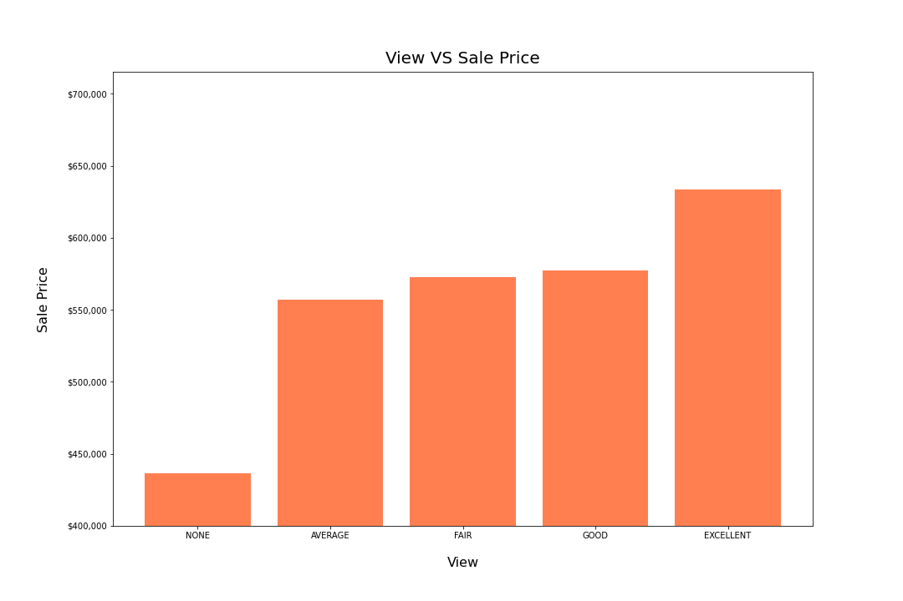

(image courtesy of [beautifulwashington.com](https://beautifulwashington.com/))

# Analysis of King County Real Estate Data

**Authored by:**
- Luke Dowker [(Github)](https://github.com/toastdeini) | [(LinkedIn)](https://www.linkedin.com/in/luke-dowker/)
- Jawwad Siddiqui [(Github)](https://github.com/jsiddiqui85) | [(LinkedIn)](https://www.linkedin.com/in/jsiddiqui85/)
- Xiaohua Su [(Github)](https://github.com/xiaohua-su) | [(LinkedIn)](https://www.linkedin.com/in/xiaohua-su/)

## Overview

The COVID-19 pandemic has [thrust residential real estate markets across the United States](https://www.curbed.com/article/inside-the-covid-19-housing-market-of-upstate-new-york.html) into near-perpetual "seller's market" status, and Seattle's relatively newfound position as a "tech hub" has [driven up the city's population](https://www.seattletimes.com/seattle-news/data/covid-slowed-but-didnt-stop-population-growth-in-seattle-washington-hits-7-7m-residents/) (and cultural cache!) substantially in the last decade. This positions our client, **UNIQUE Home Construction, LLC**, 

## Business Problem

A boutique residential contractor - [Unique Home Construction, LLC](https://www.uniquehomeco.com/) - has tasked us with assessing which **features** of a house best predict its final sale price. They are looking to minimize the **risk** involved in constructing new builds without compromising features that are important to customers.

In other words, what attributes or features of a property should UNIQUE Home Construction, as custom home builders, focus on when constructing new homes?

## Data


The data used in this project covers home sales in King County, WA for a period spanning from May 2014 to May 2015. In addition to providing basic information about the sale itself - each house has a unique `id` value, and each record contains a value for `date` and `price` - the dataset lists various attributes of each home: whether it's on a `waterfront`, the `grade` of its build and materials, the `condition` of the home, whether it has a scenic `view`, the year of its renovation (`yr_renovated`, where applicable), among others.

## Methods

Our **target variable** `y` - i.e. what we are **trying to predict** - is the sale price of a home, represented under the column `price` in the dataset. We start with a baseline model using scikit-learn's `DummyRegressor` feature, then create a *simple model* using the correlated feature `sqft_living`. We then tested several models with different combinations of features.

## Results

### `sqft_living`


### `grade`


### `view`



### Final model

- **Train score:**
- **Test score:**
- **Train RMSE:**
- **Test RMSE:**

    
## Conclusions: Where to Focus!


(image courtesy of [Al Jazeera](https://www.aljazeera.com/))

1. `sqft_living` - There's no need to construct mansions in order to fetch a high sale price, as there *are* diminishing returns on price vs. livable square footage past a certain point - we recommend somewhere in the range of 1,500 to 3,000 square feet.
2. `grade` - Ensuring that a house is built from high-quality materials, and constructed by competent professionals, will yield a higher sale price than "cutting corners" in the construction.
3. `view` - Buyers love a scenic view, and while homes with "excellent" views yield the highest sale prices on average, even a "good" or "average" view tends to make the property more valuable than a home *without* a view.

## Next Steps

1. Exploratory data analysis & descriptive statistics reveal that the mean price for a `waterfront` property is much higher than one without `waterfront` view - 
2. While the data stored in `zipcode` was not useful for the purposes of our modeling workflow, visualizing sale price with mapping software can potentially identify
3. Conduct more refined analysis on how `bedroom` and `bathroom` count can be optimized without "overbuilding" or constructing unnecessarily large properties.

## Repository Structure
```
├── Workspace_Jawwad
│       ├── EDA of Real Estate.ipynb
│       ├── Train Test Split.ipynb
│       └── Workspace_Jawwad.ipynb
├── Workspace_Luke
│       ├── Analysis_Notebook_Luke.ipynb
│       └── Initial_EDA_Luke.ipynb
├── Workspace_Xiaohua
│       ├── Xiaohua.ipynb
│       └── Untitled.ipynb
│
├── data
├── images
├── README.md
└── King_County_Real_Estate_Analysis.ipynb
```
### Additional information and citations

- Full analysis available in the project [Jupyter notebook]()
- Stakeholder-facing [presentation]()


["Inside the Freak-out Housing Market of Upstate New York"](https://www.curbed.com/article/inside-the-covid-19-housing-market-of-upstate-new-york.html)

["What exodus? Seattle and Washington kept growing during pandemic"](https://www.seattletimes.com/seattle-news/data/covid-slowed-but-didnt-stop-population-growth-in-seattle-washington-hits-7-7m-residents/)